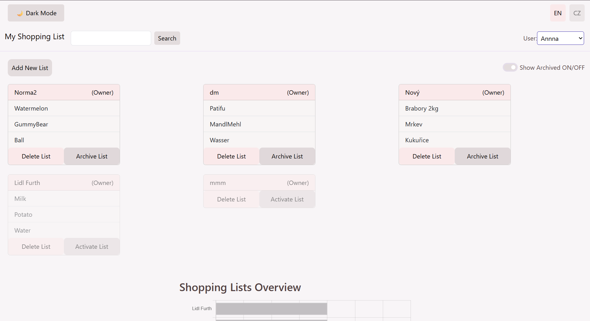
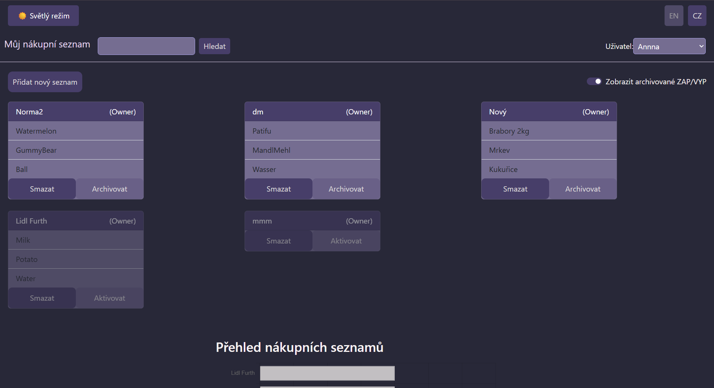
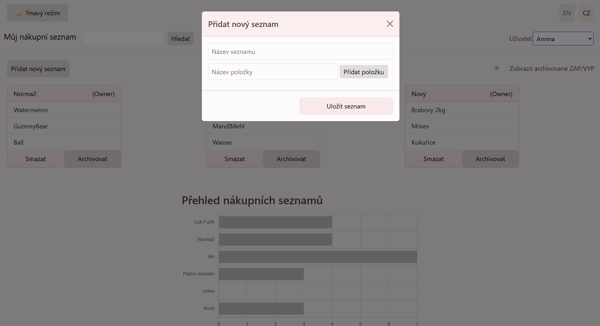
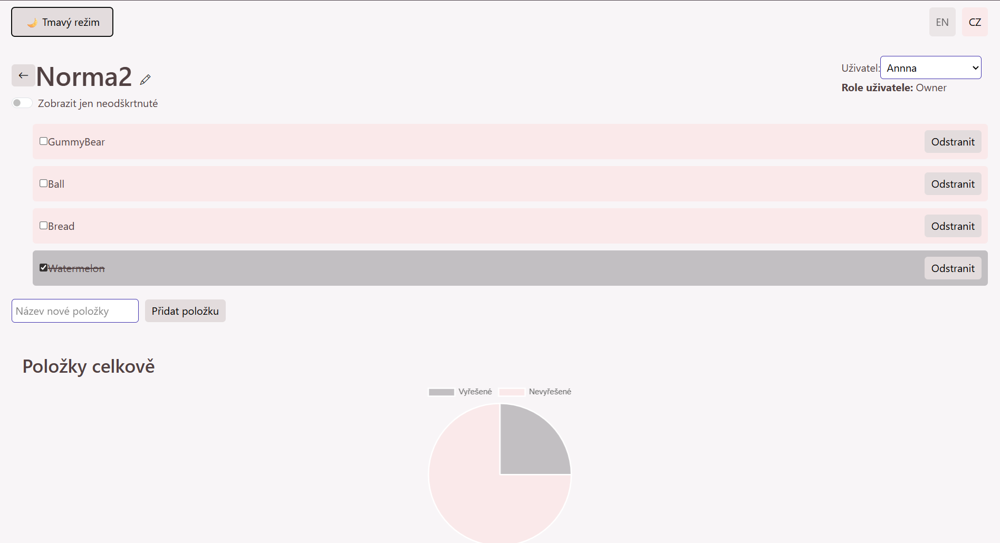

# My Shopping List

Webová aplikace pro správu nákupních seznamů s podporou více uživatelů, statistik a vícejazyčného rozhraní.

## Live Demo

https://my-shopping-list-ghmvhivge-anastasie.vercel.app/

## Funkce

* vytváření a správa nákupních seznamů
* přidávání, úprava a mazání položek
* statistiky nákupů pomocí grafů
* podpora více uživatelů
* přepínání jazyků (CZ/EN)
* Light/Dark mode
* REST API

## Použité technologie

### Frontend

* React
* JavaScript
* Bootstrap
* Axios
* Chart.js
* i18next

### Backend

* Node.js
* Express


### Databáze
* MongoDB Atlas
* Mongoose

## Struktura projektu

```text
client/  - React frontend
server/  - REST API backend
```

## Spuštění


### Frontend

```bash
cd client
npm install
npm start
```

### Backend

```bash
cd server
npm install
npm start
```
## Ukázky aplikace








